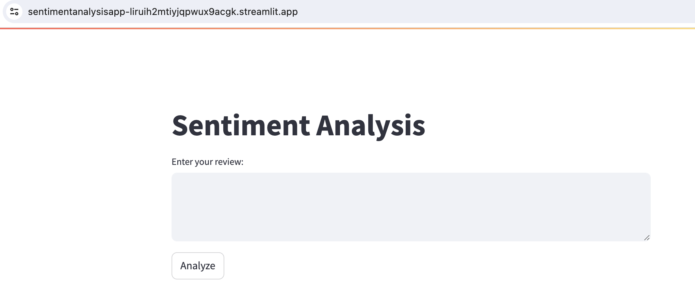

# Sentiment Analysis App

A web application that uses a fine-tuned DistilBERT model to analyze sentiment in product reviews.

The app can be accessed at: https://sentimentanalysisapp-liruih2mtiyjqpwux9acgk.streamlit.app/

## Project Objective

The objective of this project is to fine-tune a DistilBERT model using Amazon and eBay review data to help determine whether a review is positive or negative. The trained model is then integrated into a web application developed using Streamlit.

## Technologies Used

- Python 3.x
- Transformers library
- PyTorch
- Streamlit

## Features

- Fine-tuned DistilBERT model for sentiment analysis
- User interface for inputting product review text
- Real-time sentiment classification (positive or negative) of the review
